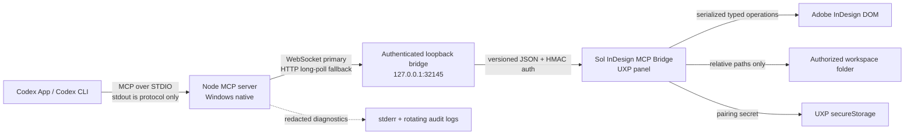

# Sol InDesign MCP

`sol-indesign-mcp` is a local, authenticated Model Context Protocol (MCP) integration that lets OpenAI Codex inspect and modify Adobe InDesign documents through a dedicated UXP panel. It exposes a small, typed operation language instead of arbitrary JavaScript, ExtendScript, COM, UI automation, or unrestricted DOM access.

[](https://github.com/andreigheo/sol-indesign-mcp/actions/workflows/ci.yml)
[](LICENSE)

This repository is maintained by [Andrei Gheorghe](https://github.com/andreigheo). It is an early open-source release: the development bridge has been exercised on a real Windows/InDesign host, while broader community adoption and a production Adobe distribution identity remain future milestones.

## Why this project exists

Creative workflows often need both an AI coding agent and a desktop publishing application. Sol InDesign MCP provides a local control boundary for that workflow: Codex speaks MCP over STDIO, a native Node server owns authentication and policy, and a UXP panel performs only typed, allowlisted InDesign operations. The design prioritizes document identity, bounded outputs, workspace confinement, explicit approvals, and recoverable Undo behavior.

The project is useful for developers building reproducible InDesign automation, design-system tooling, document QA, export workflows, and agent-assisted publishing experiments without exposing a general-purpose script runner.

The supported deployment is deliberately local and Windows-native:

- Codex starts the Node.js MCP server over STDIO.
- The server listens only on `127.0.0.1:32145` for the UXP plugin.
- The UXP plugin is the only component that touches the InDesign DOM.
- File access stays below one user-authorized workspace folder.
- All document mutations are explicit, revision-checked, serialized, and grouped into one InDesign Undo step per batch.

> **Real-host validation status (2026-07-16): all production tools and operation variants have installed-host evidence.** UXP Developer Tool 2.2.1.2 loaded the development build in stable InDesign 21.4.1 / UXP 9.3. All eleven tools, all sixteen operation variants, authenticated WebSocket and HTTP fallback, preview, save-copy, PDF/PNG/JPEG/IDML export, security failures, preflight, exact grouping membership, grouped-child reference resolution, and one-step Undo have real-host evidence. The final grouping batch returned four resolvable aliases, and one human Undo removed the complete batch while preserving its sentinel layer. See [the current evidence](docs/real-host-validation-2026-07-16.md) and [manual integration test](docs/manual-integration-test.md).

## Architecture



No raw InDesign object, native absolute path, token, document text dump, or authentication frame crosses an unintended boundary. The bridge accepts one authenticated plugin connection and uses request/trace IDs, deadlines, an 8 MiB frame limit, heartbeats, stale detection, and bounded reconnect backoff.

The workspace contains:

- `apps/mcp-server`: MCP registration, STDIO transport, authenticated loopback bridge, audit logging, and health reporting.
- `apps/indesign-uxp`: vanilla TypeScript/HTML/CSS panel, transport clients, serial DOM queue, workspace resolver, and InDesign adapter.
- `packages/protocol`: the only source of Zod schemas for tools and bridge messages.
- `packages/domain`: unit/bounds conversion, identity, revisions, fingerprints, operation planning, and the adapter interface.
- `packages/security`: portable path/redaction rules plus runtime-specific authentication and token helpers.
- `packages/testkit`: fake adapter, mock authenticated UXP client, fixtures, and contract harnesses.

See [the architecture decisions](docs/adr/) for the trade-offs behind UXP, loopback transport, workspace confinement, object identity, and Undo behavior.

## Prerequisites

Use native Windows processes. Do not run the server from WSL: a WSL Node process is outside the supported loopback, path, credential, and host assumptions.

- Windows 10 or 11.
- Adobe InDesign stable, version 18.5 or newer. The development target is stable InDesign 21.4.1; beta 21.5 is not part of the tested target.
- Adobe UXP Developer Tool (UDT) for development loading and real-host testing. Version 2.2.1.2 is installed on the current development machine.
- Node.js **22.22.3**, installed natively for Windows.
- pnpm **11.13.0** through Corepack.
- Codex App and/or Codex CLI with the repository marked trusted if using project-scoped `.codex/config.toml`.

Verify that PowerShell resolves Windows Node, not WSL or a compatibility shim:

```powershell
where.exe node
node -p "process.platform + ' ' + process.version"
```

The second command must print `win32 v22.22.3`.

## Install and build on Windows

Open PowerShell in the repository root, for example `C:\Users\Andrei\Documents\InDesign`:

```powershell
corepack enable
corepack prepare pnpm@11.13.0 --activate
pnpm --version
pnpm install
pnpm build
```

The supported developer commands are:

| Command | Purpose |
| --- | --- |
| `pnpm clean` | Remove generated build/test/package artifacts. |
| `pnpm build` | Build all packages, the MCP server, and the UXP bundle. |
| `pnpm dev:mcp` | Run the MCP server in development mode. Its stdout remains reserved for MCP. |
| `pnpm dev:uxp` | Watch and rebuild the UXP plugin. |
| `pnpm lint` | Run the strict lint gate, including the explicit-`any` prohibition. |
| `pnpm typecheck` | Type-check all strict TypeScript project references. |
| `pnpm test` | Run unit tests. |
| `pnpm test:contract` | Run authenticated bridge contracts and mock end-to-end tests. |
| `pnpm verify` | Run lint, typecheck, unit tests, contract tests, one workspace build, and artifact/package smoke checks. |
| `pnpm setup:token` | Create the shared pairing token outside the repository. |
| `pnpm doctor` | Check builds, configuration, token presence, port availability, and bridge status without exposing secrets. |
| `pnpm package:uxp` | Build and validate a deterministic development CCX package. |
| `pnpm sync:uxp-host` | Mirror the verified build to InDesign's External bundle and prove source/dist/CCX/host hashes match. |

`pnpm package:uxp` uses the development plugin ID `com.sol.indesign-mcp`. A distributable package still requires an Adobe-issued plugin ID and packaging/installation proof in UDT; the development CCX is not a production distribution claim.

After a successful native-Windows `pnpm verify`, run `pnpm sync:uxp-host` before the single cold UDT load. It validates the canonical root `artifacts\com.sol.indesign-mcp-0.1.0.ccx`, mirrors exactly the four approved dist files into the registered External bundle, and fails unless source, dist, package, and host copies are byte-for-byte identical. The repository no longer has a second package command or legacy app-local CCX destination.

## Pairing token

Generate the token once from native Windows PowerShell:

```powershell
pnpm setup:token
```

The command creates a random 32-byte base64url token in:

```text
%LOCALAPPDATA%\Sol\InDesign MCP\credentials.json
```

The setup script removes inherited ACLs, grants the current Windows user access, refuses to replace an existing token, and displays a new token once so it can be pasted into the panel. It does not send the token through the logger. Rotate deliberately with:

```powershell
pnpm setup:token -- --rotate
```

Rotation invalidates the token already stored by the plugin. Pair the panel again after rotation.

The server resolves its token in this order:

1. `SOL_INDESIGN_MCP_TOKEN` in the native Windows process environment.
2. The LocalAppData credential file above.

Do not place a token directly in `.codex/config.toml`, source control, a prompt, a diagnostic report, or a command argument captured by shell history.

## Configure Codex

Copy [`.codex/config.toml.example`](.codex/config.toml.example) to `.codex/config.toml`, replace the example Windows paths, and keep `.codex/config.toml` uncommitted if it contains machine-specific settings. Project-scoped MCP configuration is used only for trusted repositories.

The example:

- launches the built server with native `node.exe`;
- forwards `SOL_INDESIGN_MCP_TOKEN` by variable name when it is set, without embedding the value;
- uses the installed Codex-compatible `auto` approval mode for read-only tools;
- explicitly prompts for document mutation and export tools;
- allows the server to be unavailable without making all Codex startup fail.

After editing the configuration, restart Codex. In the CLI, `codex mcp list` should show `indesign`; `/mcp` shows its current state in an interactive session. Codex starts the STDIO server as needed, so do not start a second copy on the same port.

When Codex desktop routes the agent through WSL, the same pinned native Windows Node can be launched with `command = "node.exe"` and no `cwd`, provided the Windows Node directory is present in both the Windows PATH and WSL's imported Windows PATH. The script argument remains an absolute native Windows path. This still runs `process.platform === "win32"`; it does not switch the server to WSL Node.

## Load the UXP plugin for development

These steps require UXP Developer Tool. They were executed successfully on the current development machine on 2026-07-15, but must be repeated for each candidate bundle:

1. Install UXP Developer Tool through the supported Adobe distribution channel and sign in to Creative Cloud.
2. Run `pnpm build` from native Windows PowerShell.
3. Start stable Adobe InDesign.
4. In UDT, add the plugin by selecting `apps\indesign-uxp\dist\manifest.json`.
5. Select the target stable InDesign instance and load the plugin.
6. Open **Sol InDesign MCP Bridge** from InDesign's plugin/panel UI.

When `requiredPermissions` changes, use a full **Unload** followed by **Load** in UDT; **Reload** alone can retain the host's prior permission registration. The plugin's only network APIs are the global UXP `WebSocket` client for the primary bridge and global `fetch` for authenticated HTTP session creation, frame send/poll, and session deletion. It does not use XHR, webview, remote code, or a configurable endpoint.

The plugin does not assume that InDesign auto-starts it. Open the panel at least once per InDesign session. The loaded panel connects automatically and keeps reconnecting with bounded backoff; the **Disconnect** button suppresses reconnection until **Connect** is pressed.

Keep UDT's plugin console open during first-host validation. A load failure caused by manifest permissions or an unavailable runtime member is a real integration failure, not something the mock tests can rule out.

## Pair the panel

1. Ensure the Codex-managed MCP server is running, or start `pnpm dev:mcp` for a development bridge session.
2. Open **Sol InDesign MCP Bridge** in InDesign.
3. Choose **Pair token**, paste the one-time value printed by `pnpm setup:token`, and confirm.
4. Ensure the token field clears and remains masked.
5. Choose **Connect** if the panel is not already reconnecting.
6. Confirm that the panel reports `authenticated`, bridge protocol `sol-indesign-bridge/1`, and the expected plugin/InDesign versions.

The token is stored only in UXP `secureStorage`. The handshake sends a random 32-byte nonce and an HMAC-SHA256 digest; the raw token is never sent over the bridge.

## Authorize a workspace

Choose **Select workspace** in the panel and select one directory. UXP returns a folder entry and the plugin stores only its persistent token in plugin persistent storage. The authentication token and workspace token use different storage mechanisms.

Every tool path is relative to this authorized directory and uses forward slashes, for example:

```text
previews/layout-v1.png
exports/layout-v1.pdf
copies/layout-v1.indd
assets/logo.png
```

Absolute paths, drive letters, UNC paths, file URLs, backslashes, dot segments, traversal, empty segments, control characters, trailing dots/spaces, and Windows device names are rejected independently by both server and plugin. Native paths never cross the bridge. Existing output files fail with `FILE_EXISTS` unless the request explicitly includes `overwrite: true` and Codex receives the applicable destructive-tool approval.

Use **Clear workspace authorization** to discard the stored persistent folder token. Select the folder again if UXP reports that a previously stored token is stale.

## Tool catalog

All tools return a trace ID and a discriminated outcome. Outputs are bounded and never contain unbounded story text or raw DOM values. Every tool advertises `openWorldHint: false`; annotations are advisory, while handlers enforce security deterministically.

| Tool | Purpose and important inputs | Class | Deadline |
| --- | --- | --- | ---: |
| `indesign_status` | Report server/bridge/plugin/workspace state, active-document summary, capabilities, queue depth, heartbeat, and last safe error code. Empty input. | Read-only, idempotent | 5 s |
| `indesign_list_documents` | List bounded document references; `maxDocuments` defaults to 50 and is capped at 200. | Read-only, idempotent | 5 s |
| `indesign_get_document_snapshot` | Return a bounded snapshot for an explicit `documentRef`; depth 0–8, at most 2,000 items, with opt-in snippets/styles/links/warnings and truncation metadata. | Read-only, idempotent | 30 s |
| `indesign_get_selection` | Return at most 100 references from the explicit document, with optional short snippets. Selection is inspected, never used as an implicit write target. | Read-only, idempotent | 30 s |
| `indesign_inspect_items` | Inspect 1–100 explicit object references with bounded detail flags and ownership checks. | Read-only, idempotent | 30 s |
| `indesign_create_document` | Create A4 or a bounded custom document with orientation, 1–100 pages, facing-page, margin, and bleed options. This is the only write without a pre-existing revision. | Additive write | 60 s |
| `indesign_apply_operations` | Dry-run or execute 1–100 typed operations against an explicit document and expected revision; returns aliases, revision, warnings, and partial-failure details. | Mutation; approval required | 60 s |
| `indesign_export_preview` | Export one explicit page to required `previews/*.png`, bounded to 256–2,048 px and 4 MiB; returns metadata, relative path, and MCP PNG image content. | File write; approval required | 110 s |
| `indesign_save_copy` | Save an `.indd` copy below the workspace while leaving the source document open. Requires document/revision and defaults `overwrite` to false. | File write; approval required | 110 s |
| `indesign_export_document` | Export PDF with a named preset, explicit-page PNG/JPEG, or IDML to a relative path; defaults `overwrite` to false. | File write; approval required | 110 s |
| `indesign_run_preflight` | Run the selected/default preflight profile, return at most 500 normalized findings, and report custom missing-font/link/overset checks separately. | Read-only, idempotent | 110 s |

The strict `indesign_delete_items` input schema exists for compatibility planning, but the tool is not registered or advertised. Deletion is not available in the MVP.

### Typed operation language

`indesign_apply_operations` accepts only these operations:

```text
ensure_layer
create_page
create_rectangle
create_oval
create_text_frame
set_text
set_item_bounds
set_item_appearance
create_or_update_color
create_or_update_paragraph_style
apply_paragraph_style
create_or_update_object_style
apply_object_style
place_file
group_items
move_item_to_layer
```

An operation can define a unique local alias; a later operation in the same batch can target that alias. The plugin validates the entire plan, resolves existing targets and resources, validates workspace files, and constructs a virtual alias table before making changes. `dryRun: true` performs the same validation and makes no document or file change.

Public geometry is page-relative `{ x, y, width, height, unit }`, where `unit` is `pt`, `mm`, `cm`, `in`, or `px`. Conversion to InDesign's `[top, left, bottom, right]` point bounds is centralized; the plugin never changes global ruler preferences to calculate geometry.

## Safe prompting pattern

Codex receives server instructions to inspect state before writes. A reliable sequence is:

1. Call `indesign_status`.
2. List documents or use the explicit document reference returned by status.
3. Call `indesign_get_document_snapshot` and retain its revision.
4. Dry-run one complete, validated batch.
5. Ask for approval and run the same batch with the expected revision.
6. Export and inspect a preview after major visual changes.
7. Refresh the snapshot before another write.

For the first `indesign_create_document` call, no pre-existing document can be snapshotted; call status, create the document, then snapshot the returned document before applying operations.

Example prompts:

```text
Check InDesign status and list the open documents. Do not modify anything.
```

```text
Inspect the document named only for display as "Brochure.indd". Use its explicit
documentRef, request a bounded snapshot with text snippets, and summarize the
page structure without changing the document.
```

```text
Create a one-page portrait A4 document. Snapshot the returned document, then
dry-run one batch that creates an "MCP Artwork" layer, a 60 mm by 30 mm cyan
rectangle at 20 mm, 20 mm, and a text frame below it containing "Summer 2026".
Show the validation result and ask before executing the batch.
```

```text
Refresh the snapshot and use its current revision. Export page 1 to
previews/summer-2026.png without overwriting an existing file, inspect the
returned preview image, and describe any alignment problems. Do not alter the
document unless I approve a follow-up batch.
```

```text
Using the explicit documentRef and current revision, save a copy to
copies/brochure-review.indd and export a PDF to exports/brochure-review.pdf
with the installed preset named "[High Quality Print]". Never overwrite.
```

Preset names are installation- and locale-dependent. Use an exact preset that exists in the target InDesign host; the server returns `PRESET_NOT_FOUND` rather than substituting arbitrary export preferences.

## Revisions, identity, and Undo

Document and object names are display-only. References contain a document UUID, native ID when available, kind/ownership information, optional persistent UUID, and optional fingerprint.

Read-only inspection does not mutate unlabeled documents or objects. The plugin uses session identity for an unlabeled document and persists `com.sol.indesign-mcp.document-uuid` during its first sanctioned write. It adds `com.sol.indesign-mcp.object-uuid` and a closed semantic `com.sol.indesign-mcp.object-kind` label only when that item is first modified by MCP. The kind label preserves typed identity when UXP exposes a grouped child only as a generic `PageItem`; resolution still requires the document, native ID, UUID when present, expected kind, and fingerprint when supplied.

Every MCP mutation checks `expectedRevision`. Successful and partial mutations increment the plugin-maintained revision; a mismatch returns `STALE_DOCUMENT`. The next revision is reserved in ordinary UXP persistent storage immediately before DOM execution, committed after success or partial mutation, and rolled back when execution confirms no mutation. This preserves the counter across plugin Reload and makes a crash-safe reservation conservatively stale rather than reusable. Fingerprint mismatches return `OBJECT_STALE`. This detects MCP races and some relevant object changes, but it cannot detect every manual InDesign edit. Refresh snapshots whenever a person may have changed the document. Clearing the plugin's persistent data is a coordination reset and invalidates all outstanding document references.

A real batch executes through function-form `app.doScript` with `UndoModes.ENTIRE_SCRIPT` and a unique human-readable label. That produces one Undo step, not an ACID transaction. If InDesign fails after some operations, the response reports completed operations, `partialChanges`, `undoRecommended`, and the exact Undo label. The plugin does not blindly call `undo()` because that could undo a human action.

Undo proof is scoped to the explicit active document: its documented `undoName`/`redoName` must match the trace-derived label exactly. The application-wide names remain bounded diagnostics because InDesign 21.4.1 can report a different global stack action while the target document reports the correct one. An application-only match is never accepted, and a stale reference is not treated as proof that a created object disappeared.

## Security model

The main controls are:

- loopback-only binding to `127.0.0.1`, never a LAN interface;
- UXP network permission limited to `ws://localhost:32145` and `http://localhost:32145`; the trusted client uses those fixed origins while the server remains bound only to `127.0.0.1:32145` under ADR 0005;
- HMAC challenge-response with single-use, expiring nonces and timing-safe comparison;
- bounded authentication attempts and one active authenticated plugin;
- strict Zod schemas and JSON-only bridge values;
- an allowlisted operation DSL with no arbitrary code/property execution;
- independent server/plugin path validation and one user-authorized workspace;
- explicit document references, revision checks, ownership checks, and serialized DOM access;
- safe overwrite defaults and approval-gated mutation/export tools;
- redacted stderr and rotating LocalAppData audit logs; MCP stdout contains protocol frames only;
- preference guards that restore every touched readable export/preflight preference in `finally`.

Tool annotations and Codex approvals improve operator safety but are not security boundaries. The server and plugin enforce every rule even if a caller ignores annotations. See [SECURITY.md](SECURITY.md) for trust boundaries, threats, secret handling, and vulnerability reporting.

## Automated verification

`pnpm verify` is the automated acceptance gate. Its intended coverage includes:

- strict schemas, error envelopes, message bounds, and stdout purity;
- unit and bounds conversion;
- path traversal, Unicode, and Windows reserved-name rejection;
- HMAC vectors, timing-safe comparison, authentication limits, and reconnect behavior;
- deadline/cancellation behavior and serial queue ordering;
- document/object ownership, stale revisions/fingerprints, aliases, and dry-run zero mutation;
- error mapping, preference restoration, failure paths, and preflight truncation;
- authenticated WebSocket contracts, HTTP polling fallback, and mock MCP-to-adapter end-to-end flow;
- preview image-content contract, manifest permission validation, bundle inspection, doctor redaction, and CCX structure.

The static README does not claim a command passed merely because the test exists. Use the current `pnpm verify` output and release handoff as evidence for the exact automated run. Real-host probes are recorded separately and do not become release evidence until all 14 manual steps pass in one clean run.

## Known limitations

- Real InDesign 21.4.1 integration has installed-host evidence for all eleven tools, all sixteen operation variants, exact grouping, and one-step Undo. A single immutable-commit release record and Adobe-issued distribution identity remain release-process requirements.
- The panel may need to be opened once in every InDesign session.
- UXP 9.3 discards IP-literal manifest domains but accepts exact port-qualified localhost domains. The trusted bundle contains only the two fixed bridge URLs on port 32145; omitted/different ports, IP-literal client URLs, paths as permissions, wildcards, external domains, and `all` are rejected by package validation.
- Plain `ws://` loopback acceptance, authenticated HTTP fallback, UXP File-to-DOM placement/export/save interoperability, atomic color creation, bounded preflight, exact PageItems-range grouping, grouped-child reference resolution, and one-step Undo were observed in InDesign 21.4.1 / UXP 9.3. Other undocumented runtime behavior remains feature-detected and fails closed with `UNSUPPORTED_CAPABILITY`.
- The plugin maintains MCP revisions; manual edits are not exhaustively observed.
- Active synchronous InDesign DOM calls cannot always be interrupted. A timeout says that an operation may have completed and does not falsely claim cancellation.
- One authenticated plugin connection and one serial DOM queue are supported.
- Undo grouping is one user-visible Undo step, not transactional rollback.
- Preflight warning severity is not fabricated. When the host does not expose it reliably, `warningCount` is `null` and `warningCountAvailable` is false.
- Export supports only verified PDF, PNG, JPEG, and IDML paths. PDF uses a named installed preset; arbitrary preference bags are rejected.
- Saving over the open source document, closing documents, packaging, deletion, arbitrary script execution, COM, and UI automation are intentionally unavailable.
- The development CCX is not ready for distribution without an Adobe-issued ID and host packaging/installation proof.

## Troubleshooting

### `BRIDGE_OFFLINE`

- Open the panel once in stable InDesign.
- Confirm the MCP server listens on `127.0.0.1:32145` and the plugin uses `localhost:32145` only.
- Confirm the manifest contains exactly `ws://localhost:32145` and `http://localhost:32145`. After changing permissions, use UDT **Unload** then **Load**, not only **Reload**.
- Run `pnpm doctor`; stop a duplicate server if the port is already occupied.
- Check that Windows Firewall or endpoint software is not blocking local processes.
- Press **Connect** if **Disconnect** was previously used.

### `BRIDGE_AUTH_FAILED`

- Pair with the token generated by the same Windows user as the server.
- If the server token was rotated, pair the panel again.
- Do not add whitespace when pasting the base64url token.
- After repeated failures, wait for the bounded rate-limit window before retrying.

### `BRIDGE_PROTOCOL_MISMATCH`

Rebuild both server and plugin from the same checkout, reload the plugin in UDT, and restart Codex. Do not mix an older plugin bundle with a newer server.

### `WORKSPACE_NOT_AUTHORIZED` or `PATH_NOT_ALLOWED`

Select the workspace again in the panel. Use an NFC-normalized relative path with `/` separators. Do not pass `C:\...`, `\\server\share`, `file://...`, backslashes, `.`/`..`, or a Windows device name.

### `FILE_EXISTS`

Choose a new relative output name. Use `overwrite: true` only after confirming the exact target and accepting the destructive approval.

### `STALE_DOCUMENT` or `OBJECT_STALE`

Call `indesign_get_document_snapshot` or `indesign_inspect_items` again and review the new state. Never retry a stale mutation by silently replacing the expected revision or fingerprint.

### `UNSUPPORTED_CAPABILITY`

Record the InDesign and plugin versions shown in the panel, copy redacted diagnostics, and verify the member in the current [InDesign UXP DOM reference](https://developer.adobe.com/indesign/uxp/dom/api/). The plugin intentionally fails closed instead of guessing an API.

### Codex cannot start the server

- Confirm the `command`, `args`, and `cwd` in `.codex/config.toml` are absolute Windows paths.
- Run `node -p "process.platform"`; it must be `win32`.
- Run `pnpm build` and ensure `apps\mcp-server\dist\index.js` exists.
- Run `pnpm doctor` from native PowerShell.
- Inspect stderr/audit diagnostics, not stdout. Any ordinary text on MCP stdout is a defect.

### UDT cannot load the plugin

Build again, select the generated `manifest.json`, verify stable InDesign satisfies the manifest host version, and inspect UDT's console. Do not broaden manifest permissions to work around a load error without an ADR and corresponding security review.

## Documentation and references

- [Manual real-InDesign smoke test](docs/manual-integration-test.md)
- [Security policy](SECURITY.md)
- [Repository contributor rules](AGENTS.md)
- [Adobe InDesign UXP documentation](https://developer.adobe.com/indesign/uxp/)
- [Adobe UXP manifest reference](https://developer.adobe.com/indesign/uxp/plugins/concepts/manifest/)
- [Adobe UXP network recipe](https://developer.adobe.com/indesign/uxp/resources/recipes/network/)
- [Adobe UXP storage recipe](https://developer.adobe.com/indesign/uxp/resources/recipes/storage/)
- [Adobe InDesign UXP DOM reference](https://developer.adobe.com/indesign/uxp/dom/api/)
- [Codex MCP configuration](https://developers.openai.com/codex/mcp)
- [Codex configuration reference](https://developers.openai.com/codex/config-reference)
- [MCP tool specification](https://modelcontextprotocol.io/specification/2025-11-25/server/tools)

## License

No license has been granted by this repository yet. Treat the code as all rights reserved until a license file is added.
