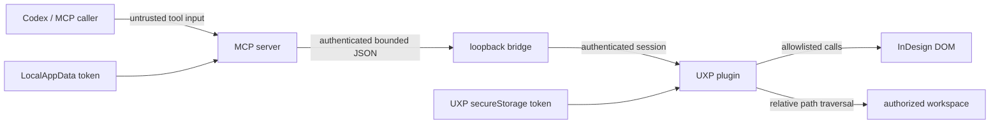

# Security policy

## Scope and security posture

Sol InDesign MCP gives an AI coding agent controlled access to a desktop publishing application and user-selected files. That is a high-impact local capability even though it listens only on loopback. The design assumes that document changes and output-file replacement can cause real data loss and therefore uses multiple deterministic controls rather than relying on prompts or MCP annotations alone.

The supported system is the code in this repository running as native Windows processes:

- the Node.js MCP server started by Codex over STDIO;
- the bridge bound to `127.0.0.1:32145`;
- the built `com.sol.indesign-mcp` UXP panel loaded in stable Adobe InDesign;
- one folder explicitly selected by the current user through the UXP file picker.

No remote service, WSL process, COM bridge, arbitrary ExtendScript executor, UI automation agent, or beta InDesign build is in the supported trust model.

## Trust boundaries



1. **MCP caller to server.** Tool arguments are untrusted even when Codex generated them. Strict Zod schemas, bounds, document references, revisions, and policy checks are enforced in handlers.
2. **Server to loopback client.** A process able to connect to a local port is not automatically trusted. It must negotiate the bridge protocol and complete challenge-response authentication.
3. **Plugin to InDesign DOM.** Bridge JSON is not a DOM capability. The plugin resolves only typed allowlisted operations and re-resolves the explicit document immediately before queued execution.
4. **Plugin to local files.** A relative path is not trusted merely because the server accepted it. The plugin validates it again and resolves it segment by segment below the user-authorized UXP folder entry.
5. **Secret stores.** The server credential and UXP credential are sensitive local state. Diagnostic and MCP outputs must never reveal either value or authentication material.
6. **Logs and support bundles.** Diagnostics may cross from the application to an operator or maintainer. They are bounded and redacted before that boundary.

## Threat model

The implementation is designed to resist these threats:

| Threat | Primary controls |
| --- | --- |
| A local, unauthenticated process connects to port 32145. | Exact loopback bind, protocol handshake, random nonce, HMAC-SHA256 authentication, expiration, failure limits, and one active authenticated plugin. |
| The UXP client uses the hostname `localhost` while the server is IPv4-only. | The manifest and transport URLs require the exact schemes and port `32145`; native Windows HTTP/WebSocket probes verify resolution to the IPv4-only listener; the server still binds only to `127.0.0.1`, no input can supply a URL, and every bridge session still requires HMAC authentication. |
| A replayed authentication digest is submitted. | A random 32-byte nonce is bound to the pending session, single-use, and expires after 15 seconds. |
| Timing measurements leak a valid digest. | The server decodes and compares fixed-shape values with Node's timing-safe comparison. Malformed values fail without a partial comparison. |
| Authentication attempts exhaust resources or brute-force the secret. | At most three pending attempts, at most three failures per connection, and at most ten failures per minute globally. Unauthenticated messages are rejected. |
| A caller traverses out of the selected workspace. | Strict portable path grammar on server and plugin, segment-by-segment UXP resolution, containment checks, and no native path in bridge messages. |
| A caller overwrites an existing output unexpectedly. | `overwrite` defaults to false; collision returns `FILE_EXISTS`; tools capable of overwrite are destructive and approval-gated. |
| A stale request modifies the wrong document or object. | Explicit document/object references, owner/kind checks, re-resolution after queue wait, expected revision, optional fingerprint, and no name/index/selection-only writes. |
| A plugin Reload makes an old revision valid again. | Per-document-instance revisions are reserved in ordinary UXP persistent storage before DOM execution, committed after success/partial mutation, and rolled back only when no mutation occurred. A crash may leave a conservative revision gap but cannot make an older reference current. |
| Concurrent requests interleave DOM changes. | Every InDesign DOM read and write uses one plugin-side FIFO queue. |
| A partially failed batch is reported as successful or silently rolled back. | Prevalidation, one labeled Undo group, completed-operation tracking, `PARTIAL_FAILURE`, `partialChanges`, and exact `undoRecommended` metadata. |
| Tool input causes arbitrary code or property execution. | Exhaustive operation discriminants and typed fields; no `eval`, `new Function`, arbitrary script text, property bags, shell, COM, or UI automation. |
| Document content or credentials leak through logs. | Structured event fields, bounded diagnostic history, redaction, no auth-frame logging, no document/file content logging, and stdout reserved for MCP. |
| Export leaves global InDesign preferences changed. | Preference guards snapshot only touched readable fields and restore them in `finally` after success or failure. |
| A caller relies on annotations as authorization. | All controls are repeated in deterministic server/plugin code. MCP hints and Codex approvals are treated as operator UX, not a security boundary. |

### Out of scope

The project cannot protect against a malicious or already-compromised Windows account, a malicious InDesign/UXP runtime, a process able to read the current user's secure stores, an operator deliberately approving destructive actions, or external changes to an exported file after the plugin releases it. Endpoint security and account isolation remain the operator's responsibility.

The plugin-maintained revision detects MCP sequencing conflicts, not every possible manual edit. Revision state is not a secret and is stored separately from the secure pairing token, under a key derived from the persistent document UUID and current native document ID. Clearing ordinary plugin data is a coordination reset and invalidates every outstanding document reference. A user can change a document between snapshot and write in ways that do not affect an optional fingerprint. The safe response to suspected human activity is to refresh the snapshot and review the plan.

## Token generation and storage

Run `pnpm setup:token` in native Windows PowerShell. It generates 32 random bytes encoded as base64url and writes the server credential outside the repository:

```text
%LOCALAPPDATA%\Sol\InDesign MCP\credentials.json
```

The setup script removes inherited ACL entries and grants access to the current Windows user. It refuses to replace an existing credential unless `--rotate` is supplied. The token is displayed only at creation so the operator can pair the panel; the logger never receives it.

The server checks `SOL_INDESIGN_MCP_TOKEN` first, then the LocalAppData file. An environment variable can be exposed by process-inspection or support tooling, so the credential file is the preferred normal configuration. Codex configuration should use `env_vars = ["SOL_INDESIGN_MCP_TOKEN"]` only to forward an already-managed value and must never embed the value in `env` or a committed file.

The UXP panel accepts the token through a masked field, clears that field after submission, and stores the secret only in UXP `secureStorage`. It does not store the authentication secret with ordinary plugin settings. The workspace folder's UXP persistent token is not the authentication secret and is kept separately in plugin persistent storage.

Rotation is intentional invalidation. After:

```powershell
pnpm setup:token -- --rotate
```

every paired plugin must be paired again. Never send a token in an issue, screenshot, prompt, diagnostic copy, chat transcript, or repository commit.

## Local bridge authentication

The bridge binds only to the exact IPv4 address `127.0.0.1` on port `32145`; it must not bind to `0.0.0.0`, `::`, a LAN address, or a hostname that can resolve elsewhere.

InDesign 21.4.1 with UXP 9.3 discards IP-literal `network.domains` entries before permission matching and retains `localhost`. The manifest therefore uses the narrowest working declarations, `ws://localhost:32145` and `http://localhost:32145`, and the trusted bundle uses those same fixed origins and bridge paths. This does not broaden the listener: the Node server still accepts traffic only on `127.0.0.1:32145`, and no MCP input, bridge frame, environment value, workspace setting, or plugin field can supply a URL. No-port localhost selectors, paths in domain entries, wildcards, external domains, and `all` remain prohibited. See [ADR 0005](docs/adr/0005-uxp-loopback-permission-granularity.md).

The handshake is:

1. The plugin sends `BridgeHello` with supported protocol versions, transport, versions, and capabilities.
2. The server selects `sol-indesign-bridge/1` and sends `BridgeChallenge` with a socket/session-bound random 32-byte nonce and expiration.
3. The plugin decodes the shared base64url token and computes `HMAC-SHA256(key = decoded token, message = UTF-8 nonce)` using the bundled hash implementation.
4. The plugin sends `BridgeAuthentication` with the session ID and base64url digest. It never sends the raw token.
5. The server verifies the session, one-time nonce, deadline, and digest with a timing-safe comparison before accepting any request/event frame.

Non-handshake traffic before authentication closes the connection. An unauthenticated or mismatched client never becomes active. A new connection cannot replace a healthy authenticated plugin; replacement is permitted only after the current connection is stale.

WebSocket is primary. After bounded load-session failures, HTTP long polling uses the same loopback host, frame schemas, challenge-response rules, limits, and active-client policy. The fallback is not a less-authenticated endpoint.

## Workspace path restrictions

The user authorizes one folder with the UXP picker. Every operation receives an NFC-normalized, `/`-separated relative path. Both the Node server and UXP plugin reject:

- empty strings and empty segments;
- absolute, drive-letter, drive-relative, UNC, device, and rooted paths;
- `file:` URLs or any URI-shaped input;
- backslashes;
- `.` and `..` segments;
- NUL/control characters;
- segments ending in a dot or space;
- Windows reserved device names such as `CON`, `PRN`, `AUX`, `NUL`, `COM1`–`COM9`, and `LPT1`–`LPT9`, including names with extensions;
- text that changes under the required normalization policy;
- any resolution that leaves the authorized folder entry.

The plugin walks the UXP folder entry one segment at a time. It passes the resulting UXP file entry to the InDesign DOM when supported. If a verified host requires `getNativePath`, conversion occurs only inside the plugin after containment validation. The native path is never serialized over the bridge or returned by an MCP tool.

`localFileSystem: "request"` is the intended manifest permission. Broad full-filesystem access is prohibited. A stale persistent workspace token returns a structured authorization error and requires the user to select the folder again.

## Document mutation risks

Every mutation except document creation requires an explicit `documentRef` and `expectedRevision`. Page items use a typed `InDesignObjectRef` with document ownership, native ID, kind, optional persistent UUID, and optional fingerprint. Names are display-only. Current selection, object index, geometry, and display name are never sufficient write targets.

Read-only calls must not mutate the document to assign identity. An unlabeled document has session identity until its first sanctioned write, when `com.sol.indesign-mcp.document-uuid` is persisted. An object receives `com.sol.indesign-mcp.object-uuid` and the closed `com.sol.indesign-mcp.object-kind` semantic label only when it is created or first modified by MCP, inside that write transaction. The kind label is trusted only beside a valid MCP UUID and is used to preserve typed identity for generic grouped-child proxies. Nested page-item lookup is bounded to 10,000 objects and depth 8, and every resolved candidate still undergoes ownership, native-ID, kind, UUID, and optional fingerprint checks.

All operations in a real batch are validated before execution. The plugin then reserves the next revision in ordinary persistent storage before calling function-form `app.doScript` with `UndoModes.ENTIRE_SCRIPT` and a unique label. It commits that revision after success or partial mutation and restores the previous value when execution confirms no mutation; a failed rollback remains conservatively advanced. This provides one document Undo step without placing revision metadata in the Undo stack, but it is not an ACID transaction. Unexpected DOM failure can leave partial changes. The plugin reports completed operations, recommends the exact labeled Undo, and never calls global `undo()` blindly.

An active synchronous DOM call may be non-interruptible. A timeout/cancellation response must state when the action may have completed. Operators should refresh status and snapshot before retrying.

## File writes and overwrite rules

- Every target is workspace-relative.
- `overwrite` is optional and always defaults to false.
- An existing target returns `FILE_EXISTS` without modification.
- `overwrite: true` is accepted only by tools whose strict schema permits it.
- Preview, save-copy, and document-export tools are annotated destructive because replacement is possible.
- Codex configuration explicitly prompts for these tools.
- `indesign_save_copy` leaves the source document open; saving over the source is unavailable.
- Delete, close-without-saving, and package operations are unavailable.
- A dry run makes no file change.

Treat approval as confirmation of the exact relative target and operation, not blanket future authorization.

## Arbitrary-code-execution prohibition

No bridge method or MCP tool may accept executable text, arbitrary DOM method/property names, unvalidated `withProperties` objects, arbitrary ExtendScript, VBScript, JavaScript, shell commands, process arguments, or COM calls.

The UXP bundle must keep `allowCodeGenerationFromStrings: false`. Do not introduce:

- `eval` or indirect eval;
- `new Function`;
- string-form `app.doScript`;
- dynamic `require` based on tool input;
- process launch, IPC, webview, or unrestricted network permissions;
- UI automation or synthesized mouse/keyboard events.

The only `app.doScript` use is the function-form wrapper around an already validated, exhaustive operation plan. Every new operation needs a typed schema, an exhaustive handler, adapter coverage, failure-path tests, and security review.

## Logging and redaction

The MCP process reserves stdout exclusively for MCP protocol frames. Operational logs use structured JSON on stderr and bounded rotating files under the current user's LocalAppData. Rotation is limited to five 5 MiB files. The plugin keeps a redacted in-memory ring capped at 200 entries.

Permitted operational fields include timestamp, level, trace ID, tool name, bridge method, duration, safe result code, and changed-object count. Diagnostics must not include:

- tokens, nonce values, HMAC inputs/digests, authentication frames, or secure-storage values;
- complete environment variables;
- document text, snippets beyond an explicitly requested bounded tool result, or object/document dumps;
- file contents or unrestricted native paths;
- raw stack traces in MCP results or copied diagnostics.

Internal diagnostic files may contain a redacted stack for maintainers, but it must remove secrets, document/file content, and unsafe paths first. The panel's **Copy diagnostic information** action writes only the bounded redacted report and never reads the clipboard.

## Manifest and dependency changes

Do not broaden network, filesystem, clipboard, code-generation, process, IPC, webview, external-domain, or inter-plugin permissions without an ADR, threat-model update, and tests. ADR 0005 authorizes only the two exact port-qualified localhost origins needed by the UXP client while the server remains IPv4-loopback-only; it does not authorize an omitted/different port, paths as permissions, wildcards, IP-literal client URLs, external hosts, or `all`. The current clipboard permission, when present, exists only for the user-initiated diagnostic copy action; plugin code must never read the clipboard.

Pin dependencies, use one Zod v4 version across packages, and keep the stable MCP SDK v1 registration isolated. Dependency updates that touch authentication, parsing, WebSocket/HTTP framing, archive packaging, or UXP bundling require focused regression tests.

## Reporting a vulnerability

Do not open a public issue containing an unpatched vulnerability, proof-of-concept document, credential, token, private file path, or sensitive diagnostic output.

Report the issue privately to the repository owner or the security contact for the distribution channel from which you received the project. Include:

- the affected commit/version and Windows/InDesign/plugin versions;
- the trust boundary and impact;
- minimal reproduction steps using non-sensitive fixtures;
- whether the problem is reachable before authentication;
- whether it can escape the authorized workspace, mutate the wrong document, expose content, or execute code;
- a redacted trace ID and relevant safe error codes;
- any proposed mitigation.

If no private channel is published for your copy, contact the repository owner and ask for one without disclosing exploit details. Preserve evidence, rotate a possibly exposed token, disconnect the panel, stop the MCP server, and avoid opening affected documents until triage is complete.

Maintainers should acknowledge privately, reproduce against the supported native-Windows architecture, assess credential rotation and document/file impact, prepare a regression test, and coordinate disclosure only after a fix or mitigation is available.
